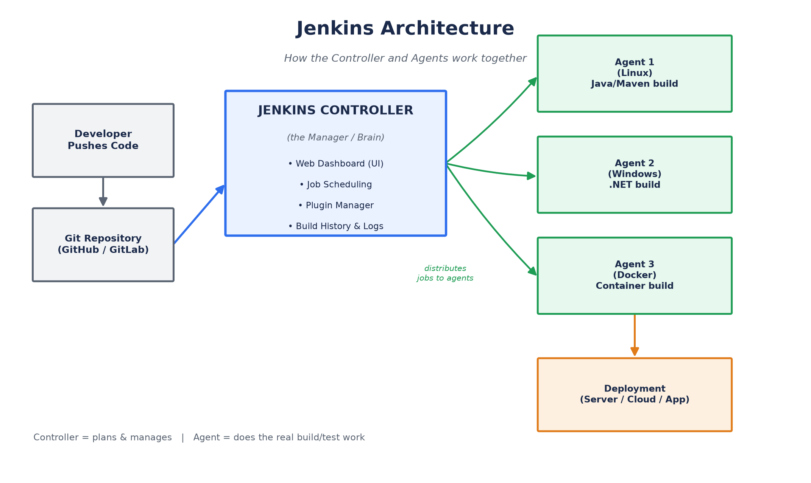
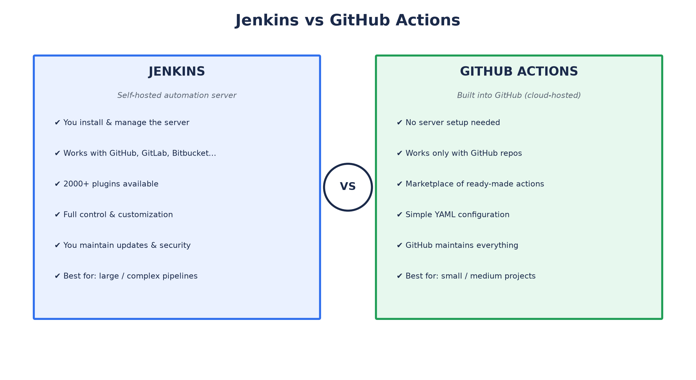
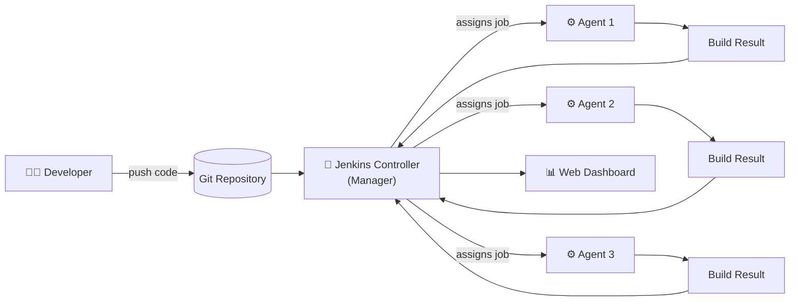
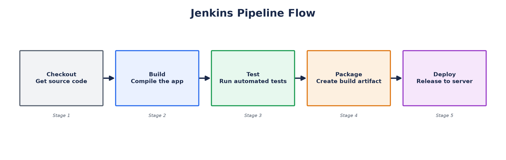
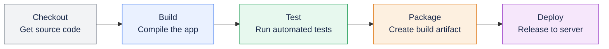
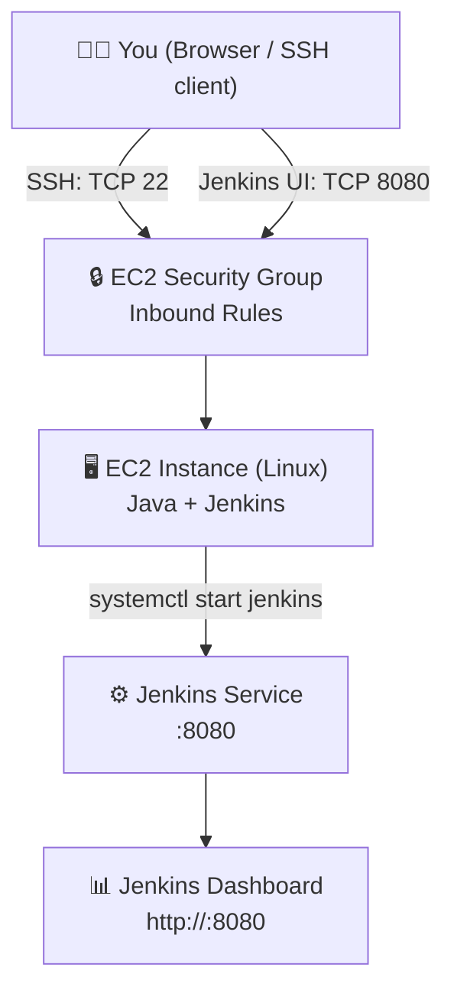

# Jenkins Introduction

A simple, beginner-to-master guide to Jenkins. This README explains everything in easy English, step by step, so anyone — even a total beginner — can understand Jenkins and start using it.



## Table of Contents

1. [What is Jenkins?](#1-what-is-jenkins)
2. [Jenkins vs GitHub Actions](#2-jenkins-vs-github-actions)
3. [Jenkins Controller](#3-jenkins-controller)
4. [Jenkins Agent](#4-jenkins-agent)
5. [Jenkins Job](#5-jenkins-job)
6. [Jenkins Pipeline](#6-jenkins-pipeline)
7. [Getting Started (Step by Step)](#7-getting-started-step-by-step)
8. [Installing Jenkins on an AWS EC2 Server (Linux)](#8-installing-jenkins-on-an-aws-ec2-server-linux)
9. [Simple Words Glossary](#9-simple-words-glossary)

---

## 1. What is Jenkins?

Jenkins is a **free and open-source tool** that helps developers build, test, and deliver (or deploy) software automatically.

Think of Jenkins like a robot helper. Every time you make a change to your code, Jenkins can automatically:

- Take your new code
- Build it (turn code into a working program)
- Test it (check if it works correctly)
- Deploy it (send it to a server so people can use it)

This whole process is called **CI/CD**:

- **CI (Continuous Integration)** — automatically combining and testing code changes often.
- **CD (Continuous Delivery/Deployment)** — automatically sending the tested code to users or servers.

### Why do people use Jenkins?

- It saves time — no need to build and test manually every time.
- It catches mistakes early — if something breaks, you know right away.
- It works with almost any programming language and tool.
- It has thousands of free plugins to connect with other tools (GitHub, Docker, AWS, Slack, etc).

---

## 2. Jenkins vs GitHub Actions

Both Jenkins and GitHub Actions are tools used for **CI/CD** (automating build, test, and deploy). But they are different in some important ways.

| Feature | Jenkins | GitHub Actions |
|---|---|---|
| **Type** | You install and manage it yourself (self-hosted) | Built directly into GitHub (cloud-hosted) |
| **Setup** | Needs a server and manual setup | Ready to use instantly inside GitHub |
| **Cost** | Free, but you pay for your own server | Free for public repos, limited free minutes for private repos |
| **Where code lives** | Works with any Git tool (GitHub, GitLab, Bitbucket, etc.) | Only works with GitHub |
| **Flexibility** | Very flexible, huge plugin library (2000+ plugins) | Simpler, uses YAML files, fewer plugins but growing |
| **Maintenance** | You must update and maintain the Jenkins server | GitHub maintains everything for you |
| **Best for** | Large companies, complex pipelines, custom needs | Small to medium projects, quick and easy setup |



### Simple Way to Remember

- **Jenkins** = Like owning your own car. More control, but you must maintain it.
- **GitHub Actions** = Like using a taxi. Easy and ready to go, but less control.

---

## 3. Jenkins Controller

The **Jenkins Controller** (previously called "Jenkins Master") is the **brain** of Jenkins.



### What does it do?

- It is the main server where Jenkins is installed.
- It stores all the settings, job configurations, and plugins.
- It shows the web dashboard (the screen you see in your browser).
- It schedules jobs and decides which agent (worker) should run each job.
- It keeps track of build history, logs, and results.

### Simple Explanation

Imagine a manager in an office:

- The manager (Controller) does NOT do the actual work.
- The manager plans the work and tells workers (Agents) what to do.
- The manager keeps records of everything that was done.

⚠️ **Important:** It is not recommended to run heavy build jobs directly on the Controller. The Controller should mainly manage and delegate tasks to Agents.

---

## 4. Jenkins Agent

A **Jenkins Agent** (previously called "Jenkins Slave") is a **worker machine** that actually does the work — building, testing, and running jobs.


### What does it do?

- Receives tasks from the Controller.
- Runs the actual build/test/deploy commands.
- Can be a physical computer, a virtual machine, a Docker container, or a cloud server.
- Sends the results back to the Controller.

### Simple Explanation

Continuing the office example:

- The Agent is the **worker/employee**.
- The manager (Controller) gives instructions.
- The worker (Agent) does the actual job and reports back when finished.

### Why use multiple Agents?

- You can run many jobs at the same time (in parallel).
- Different Agents can have different tools installed (e.g., one Agent for Java, another for Python).
- It reduces load on the main Controller server.

---

## 5. Jenkins Job

A **Jenkins Job** (also called a "Project") is a **single task** that Jenkins performs.

### What is a Job?

A Job is basically a set of instructions you give Jenkins, such as:

- "Download my code from GitHub"
- "Build the project"
- "Run the tests"
- "Deploy the application"

### Types of Jenkins Jobs

1. **Freestyle Project** — The simplest type. You configure steps using the Jenkins web interface (point and click). Good for beginners.
2. **Pipeline** — You write your build steps in code (a `Jenkinsfile`). More powerful and flexible. (Explained in detail below.)
3. **Multibranch Pipeline** — Automatically creates a pipeline for every branch in your Git repository.
4. **Folder** — Used to organize many jobs into groups.

### Simple Explanation

Think of a Job like a **recipe card**. It tells Jenkins exactly what steps to follow, in what order, to complete a task.

---

## 6. Jenkins Pipeline

A **Jenkins Pipeline** is a way to define your entire build process **as code**, using a file called a `Jenkinsfile`.





### Why use a Pipeline instead of Freestyle Jobs?

- All steps are written in code — easy to read, share, and version-control.
- You can store the `Jenkinsfile` in your Git repository along with your project.
- Supports complex workflows (build → test → deploy → notify).
- Easy to reuse and edit.

### Two Types of Pipeline Syntax

1. **Declarative Pipeline** (recommended for beginners) — simpler, structured, easier to read.
2. **Scripted Pipeline** (advanced) — more flexible, written using Groovy programming language.

### Simple Declarative Pipeline Example

```groovy
pipeline {
    agent any

    stages {
        stage('Build') {
            steps {
                echo 'Building the application...'
            }
        }
        stage('Test') {
            steps {
                echo 'Running tests...'
            }
        }
        stage('Deploy') {
            steps {
                echo 'Deploying the application...'
            }
        }
    }
}
```

### Explanation of the Example

- `pipeline { }` — Marks the start of the Pipeline.
- `agent any` — Tells Jenkins to run this on any available Agent.
- `stages { }` — A group of all the steps (stages) in order.
- `stage('Build')` — One step in the process; you can name it anything.
- `steps { }` — The actual commands to run inside that stage.

### Simple Explanation

A Pipeline is like a **flowchart** or a **checklist** written in code:

1. First, build the code.
2. Then, test it.
3. Finally, deploy it.

Each stage runs one after another (or in parallel, if configured), and you can see the whole process visually on the Jenkins dashboard.

---

## 7. Getting Started (Step by Step)

Here is a simple beginner roadmap to learn and use Jenkins from scratch:

### Step 1: Install Jenkins

- Download Jenkins from the official website: https://www.jenkins.io/download/
- Install it on your computer or server (Windows, Linux, macOS, or Docker).
- Start Jenkins and open it in your browser (usually `http://localhost:8080`).

### Step 2: Unlock Jenkins

- The first time you open Jenkins, it asks for an unlock code.
- Find the code in the Jenkins installation folder (in a file called `initialAdminPassword`).

### Step 3: Install Suggested Plugins

- Jenkins will ask if you want to install plugins.
- Choose "Install Suggested Plugins" for a good starting setup.

### Step 4: Create an Admin User

- Set up your username and password to log in to Jenkins.

### Step 5: Create Your First Job

- Click "New Item" on the dashboard.
- Choose "Freestyle project" (for beginners) or "Pipeline" (for more control).
- Give it a name and click OK.

### Step 6: Configure the Job

- Add the source code location (e.g., your GitHub repository URL).
- Add build steps (e.g., run a shell command or script).
- Click "Save".

### Step 7: Run the Job

- Click "Build Now".
- Watch the build progress and check the console output for results.

### Step 8: Try a Pipeline

- Create a new "Pipeline" job.
- Write a simple `Jenkinsfile` (see the example above).
- Run it and watch the stages appear on the dashboard.

### Step 9: Add an Agent (Optional, for scaling)

- Go to "Manage Jenkins" → "Manage Nodes and Clouds".
- Add a new Agent (a separate machine or container) to run jobs.

### Step 10: Keep Learning

- Explore plugins (Git, Docker, Slack notifications, etc).
- Learn Declarative Pipeline syntax in more depth.
- Practice building real projects with automated tests and deployment.

---

## 8. Installing Jenkins on an AWS EC2 Server (Linux)

This section shows how to launch an AWS EC2 server, open the correct **Security Group** ports (including **8080** for the Jenkins web UI), and install Jenkins on Linux — with best practices you should follow along the way.



### Step 1: Launch an EC2 Instance

- Go to the AWS Console → **EC2** → **Launch Instance**.
- Choose an AMI (image): **Amazon Linux 2023** or **Ubuntu 22.04 LTS** both work well.
- Choose an instance type: **t2.medium** (2 vCPU / 4 GB RAM) or larger is recommended. Jenkins can run on `t2.micro`, but builds may be slow or run out of memory.
- Create or select a **Key Pair** (`.pem` file) — you'll need it to SSH into the server. Keep this file safe; never commit it to Git.
- Attach at least **20 GB** of storage (EBS volume) — Jenkins jobs, plugins, and build artifacts use disk space over time.

### Step 2: Configure the Security Group (Important!)

The **Security Group** acts like a firewall for your EC2 instance. You must open the right ports so you can reach Jenkins.

| Type | Protocol | Port Range | Source | Purpose |
|---|---|---|---|---|
| SSH | TCP | 22 | Your IP only (`x.x.x.x/32`) | Connect to the server via SSH |
| Custom TCP | TCP | 8080 | Your IP, or your team's IP range | Access the Jenkins web dashboard |
| HTTP | TCP | 80 | Your IP / `0.0.0.0` (only if using a reverse proxy) | Optional — if Jenkins sits behind Nginx/ALB |
| HTTPS | TCP | 443 | Your IP / `0.0.0.0` (only if using a reverse proxy) | Optional — for secure HTTPS access |

**How to add these rules:**

1. Open the AWS Console → **EC2** → **Security Groups**.
2. Select the security group attached to your instance (or create a new one).
3. Go to the **Inbound rules** tab → **Edit inbound rules** → **Add rule**.
4. Add a rule for port **22** (SSH) and one for port **8080** (Jenkins), as shown in the table above.
5. Click **Save rules**.

⚠️ **Best Practice:** Never set the Source to `0.0.0.0/0` (anywhere) for port 8080 or 22 in production. Anyone on the internet could then try to access your Jenkins server or brute-force SSH. Always restrict the source to your own IP address or your organization's VPN/IP range. If your IP changes often, use "My IP" in the AWS console each time you connect.

### Step 3: Connect to the Instance via SSH

```bash
chmod 400 your-key.pem
ssh -i "your-key.pem" ec2-user@<EC2-Public-IP>      # Amazon Linux
ssh -i "your-key.pem" ubuntu@<EC2-Public-IP>        # Ubuntu
```

### Step 4: Install Java (Jenkins requires Java)

Jenkins needs Java (JDK 17 is recommended for current Jenkins versions).

**Amazon Linux 2023 / RHEL:**
```bash
sudo dnf update -y
sudo dnf install java-17-amazon-corretto -y
java -version
```

**Ubuntu / Debian:**
```bash
sudo apt update
sudo apt install fontconfig openjdk-17-jre -y
java -version
```

### Step 5: Install Jenkins

**Amazon Linux 2023 / RHEL:**
```bash
sudo wget -O /etc/yum.repos.d/jenkins.repo https://pkg.jenkins.io/redhat-stable/jenkins.repo
sudo rpm --import https://pkg.jenkins.io/redhat-stable/jenkins.io-2023.key
sudo dnf install jenkins -y
```

**Ubuntu / Debian:**
```bash
sudo wget -O /usr/share/keyrings/jenkins-keyring.asc https://pkg.jenkins.io/debian-stable/jenkins.io-2023.key
echo "deb [signed-by=/usr/share/keyrings/jenkins-keyring.asc] https://pkg.jenkins.io/debian-stable binary/" | sudo tee /etc/apt/sources.list.d/jenkins.list > /dev/null
sudo apt update
sudo apt install jenkins -y
```

### Step 6: Start and Enable Jenkins

```bash
sudo systemctl start jenkins
sudo systemctl enable jenkins
sudo systemctl status jenkins
```

- `start` — runs Jenkins now.
- `enable` — makes Jenkins start automatically after a server reboot.
- `status` — confirms Jenkins is running (look for `active (running)`).

### Step 7: Allow Port 8080 on the OS Firewall (if enabled)

Some Linux images also run their own local firewall in addition to the AWS Security Group. If Jenkins is unreachable even after the Security Group is open, check this:

```bash
# Ubuntu (ufw)
sudo ufw allow 8080/tcp

# Amazon Linux / RHEL (firewalld, if installed)
sudo firewall-cmd --permanent --add-port=8080/tcp
sudo firewall-cmd --reload
```

### Step 8: Access Jenkins in the Browser

Open:
```
http://<EC2-Public-IP>:8080
```

### Step 9: Unlock Jenkins

Get the initial admin password from the server:

```bash
sudo cat /var/lib/jenkins/secrets/initialAdminPassword
```

Paste this password into the "Unlock Jenkins" screen, then choose **Install Suggested Plugins**, and create your admin user (see [Section 7](#7-getting-started-step-by-step) for the rest of the first-run setup).

### Best Practices for Running Jenkins on EC2

- **Restrict access:** Never expose port 8080 (or 22) to `0.0.0.0/0`. Use a specific IP, a VPN, or a bastion host.
- **Use an Elastic IP:** A normal EC2 public IP changes if the instance is stopped/restarted. An Elastic IP keeps your Jenkins URL stable.
- **Put Jenkins behind a reverse proxy (Nginx) with HTTPS:** Instead of exposing `:8080` directly, forward `443` → `8080` through Nginx with a TLS certificate (e.g., Let's Encrypt). This lets you close port 8080 to the outside world entirely.
- **Don't run Jenkins as root:** The Jenkins installer creates a dedicated `jenkins` system user — leave it that way.
- **Back up `/var/lib/jenkins`** (the `JENKINS_HOME` directory) regularly — it contains all jobs, credentials, and configuration.
- **Keep Jenkins and plugins updated** to get security fixes.
- **Use IAM roles** (not hardcoded AWS access keys) if Jenkins needs to talk to other AWS services.
- **Enable EC2 instance monitoring/alarms** so you know if the server runs out of disk space or memory.

---

## 9. Simple Words Glossary

| Term | Simple Meaning |
|---|---|
| **CI/CD** | Automatically building, testing, and delivering code |
| **Controller** | The main Jenkins server that manages everything |
| **Agent** | A worker machine that runs the actual jobs |
| **Job** | A single automated task in Jenkins |
| **Pipeline** | A series of steps (stages) written as code |
| **Jenkinsfile** | A text file containing your Pipeline code |
| **Build** | The process of turning source code into a working program |
| **Plugin** | An add-on that gives Jenkins extra features |
| **Stage** | One step/section inside a Pipeline (e.g., Build, Test, Deploy) |
| **Dashboard** | The web page where you see and manage all your Jenkins jobs |

---

## Summary

- **Jenkins** = an automation tool for building, testing, and deploying software.
- **Jenkins vs GitHub Actions** = Jenkins is self-hosted and flexible; GitHub Actions is built-in and easy.
- **Controller** = the brain/manager that plans and tracks jobs.
- **Agent** = the worker that actually runs the jobs.
- **Job** = a single task Jenkins performs.
- **Pipeline** = a full automated workflow written as code, made of stages.

With these basics, you now have a clear beginner-to-master path to understand and start using Jenkins confidently.
